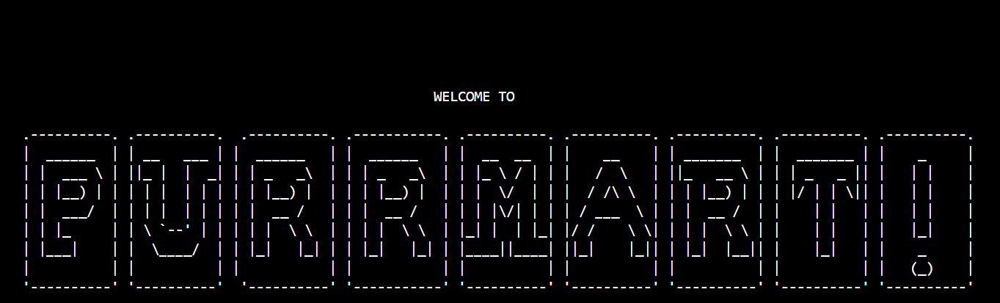

# IF2111_TB_03_03
## Table of Contents
- [Deskripsi](#deskripsi)
- [Fitur Utama](#fitur-utama)
- [Writer](#writer)
- [Cara Menjalankan](#how-to-run)
***



***
## Deskripsi
Buatlah sebuah aplikasi simulasi berbasis CLI (command-line interface). Sistem ini dibuat dalam bahasa C dengan menggunakan struktur data yang sudah kalian pelajari di mata kuliah ini. Kalian boleh menggunakan (atau memodifikasi) struktur data yang sudah kalian buat untuk praktikum pada tugas besar ini. **Daftar ADT yang wajib digunakan** dapat dilihat pada bagian *Daftar ADT*. Library yang boleh digunakan hanya:
- `stdio.h`
- `stdlib.h`
- `time.h`
- `math.h`

### Fitur Utama
**PURRMART** adalah sebuah aplikasi yang dapat mensimulasikan aktivitas beli barang pada e-commerce. Fitur utama yang disediakan adalah:
- Menampilkan barang toko
- Meminta dan menyuplai barang baru ke toko
- Menyimpan dan membeli barang dalam keranjang
- Menampilkan barang yang sudah dibeli
- Membuat dan menghapus wishlist
- Bekerja untuk menghasilkan uang
***
## Writer
| **NIM**       | **Nama**                         |
|---------------|----------------------------------|
| 18223109      | Fadhil Rifqi Rabbani Pane       |
| 18223110      | Desati Dinda Saraswati          |
| 18223136      | Geraldo Linggom Samuel T.       |
| 18223125      | Matilda Angelina Sumaryo        |
| 18222133      | Hanan Fitra Salam               |

## How to Run 
*** 
### Compile Manually
1. Pastikan berada di directory src/command.
2. Buka terminal.
3. Salin dan jalankan perintah berikut:
   ``` gcc main.c ../ADT/Stack/stack.c ../ADT/LinkedList/linkedlist.c ../ADT/User_Barang/user.c ../ADT/User_Barang/barang.c ../ADT/Mesin_Karakter/mesinkarakter.c ../ADT/Mesin_Kata/mesinkata.c ../ADT/Mesin_Baris/mesinbaris.c Start/start.c login/login.c register/register.c save/save.c load/load.c animasi/animasi.c Store_List/Store_List.c ../ADT/List/list.c ../ADT/queue/queue.c Store_Request/Store_Request.c Store_Remove/Store_Remove.c Store_Supply/Store_Supply.c workchallenge/wordl3/wordl3.c workchallenge/tebakangka/tebakangka.c work/work.c Help/help.c Logout/logout.c quit/quit.c handler/handler.c ../ADT/SetMap/setmap.c History/history.c Cart_Add/cart_add.c Cart_Remove/cart_remove.c Cart_Show/cart_show.c Cart_Pay/cart_pay.c profil/profile.c Wishlist_Add/wishlist_add.c Wishlist_Clear/wishlist_clear.c Wishlist_Remove_i/Wishlist_Remove_i.c Wishlist_Remove/Wishlist_Remove.c Wishlist_Swap/Wishlist_Swap.c Wishlist_Show/wishlist_show.c -o program ```

4. Jalankan program dengan perintah `./program` di terminal.
***
### Compile dengan Makefile
1. Pastikan berada di directory src/command.
2. Buka terminal.
3. Jalankan `make clean` di terminal. **PASTIKAN MELAKUKAN INI**
4. Jalankan `make` di terminal.
5. Jalankan `make run` di terminal.
